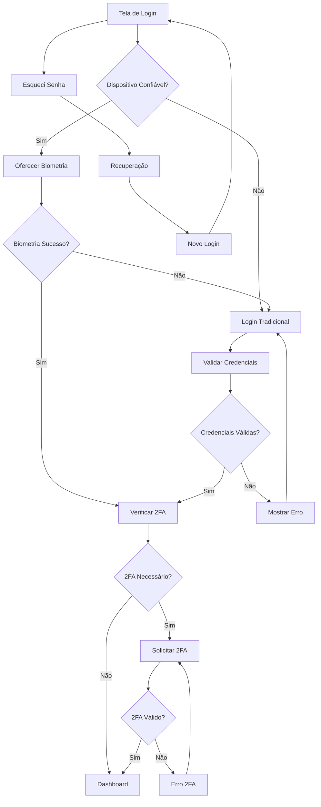

# Melhorias para a Tela de Login do BKCRM

## 1. Visão Geral do Produto

Aprimoramento da tela de login do BKCRM com foco em UX moderna, segurança avançada e acessibilidade. O objetivo é criar uma experiência de autenticação fluida, segura e inclusiva que reflita os padrões modernos de design e segurança.

## 2. Funcionalidades Principais

### 2.1 Papéis de Usuário

| Papel          | Método de Registro | Permissões Principais           |
| -------------- | ------------------ | ------------------------------- |
| Usuário Padrão | Email e senha      | Acesso básico ao sistema CRM    |
| Administrador  | Convite do sistema | Acesso completo e configurações |

### 2.2 Módulo de Funcionalidades

Nossas melhorias para a tela de login consistem nas seguintes páginas principais:

1. **Página de Login**: autenticação biométrica, validação em tempo real, feedback visual aprimorado, modo escuro/claro.
2. **Página de Recuperação de Senha**: fluxo simplificado, verificação por email/SMS, timer de reenvio.
3. **Página de Primeiro Acesso**: configuração inicial, tutorial interativo, verificação de segurança.

### 2.3 Detalhes das Páginas

| Nome da Página            | Nome do Módulo              | Descrição da Funcionalidade                                                             |
| ------------------------- | --------------------------- | --------------------------------------------------------------------------------------- |
| Página de Login           | Autenticação Biométrica     | Implementar login por impressão digital/Face ID quando disponível no dispositivo        |
| Página de Login           | Validação em Tempo Real     | Validar campos de email e senha conforme o usuário digita, com feedback visual imediato |
| Página de Login           | Indicador de Força da Senha | Mostrar medidor visual da força da senha durante a digitação                            |
| Página de Login           | Modo Escuro/Claro           | Alternar entre temas com animação suave e persistência da preferência                   |
| Página de Login           | Lembrar Dispositivo         | Opção segura para lembrar dispositivo confiável por período limitado                    |
| Página de Login           | Captcha Inteligente         | Implementar verificação anti-bot apenas quando necessário                               |
| Página de Login           | Feedback de Erro Melhorado  | Mensagens de erro específicas e acionáveis com sugestões de correção                    |
| Página de Login           | Animações Micro-interações  | Transições suaves e feedback visual para todas as interações                            |
| Página de Login           | Acessibilidade Avançada     | Suporte completo a leitores de tela, navegação por teclado e alto contraste             |
| Página de Login           | Autenticação 2FA            | Integração com apps autenticadores e SMS para segunda camada de segurança               |
| Página de Recuperação     | Fluxo Simplificado          | Processo de recuperação em etapas claras com progresso visual                           |
| Página de Recuperação     | Verificação Múltipla        | Opções de verificação por email, SMS ou perguntas de segurança                          |
| Página de Primeiro Acesso | Tutorial Interativo         | Guia passo-a-passo para novos usuários com dicas contextuais                            |
| Página de Primeiro Acesso | Configuração de Segurança   | Configurar 2FA, perguntas de segurança e preferências de notificação                    |

## 3. Processo Principal

### Fluxo do Usuário Padrão:

1. Usuário acessa a tela de login
2. Sistema verifica se dispositivo é confiável
3. Se confiável, oferece autenticação biométrica
4. Usuário insere credenciais com validação em tempo real
5. Sistema verifica necessidade de 2FA
6. Se necessário, solicita segundo fator de autenticação
7. Usuário é autenticado e redirecionado para dashboard

### Fluxo de Recuperação de Senha:

1. Usuário clica em "Esqueci minha senha"
2. Insere email com validação em tempo real
3. Escolhe método de verificação (email/SMS)
4. Recebe código de verificação
5. Insere código e define nova senha
6. Sistema confirma alteração e redireciona para login

## 4. Design da Interface do Usuário

### 4.1 Estilo de Design

* **Cores Primárias**: #3B82F6 (azul primário), #1E40AF (azul escuro)

* **Cores Secundárias**: #F8FAFC (fundo claro), #1F2937 (texto escuro)

* **Estilo de Botões**: Bordas arredondadas (12px), gradientes suaves, estados hover/focus bem definidos

* **Fontes**: Inter (títulos), System UI (corpo), tamanhos 14px-32px

* **Layout**: Design centrado, cards com sombras suaves, espaçamento consistente (8px, 16px, 24px, 32px)

* **Ícones**: Phosphor Icons com animações micro-interações

### 4.2 Visão Geral do Design das Páginas

| Nome da Página            | Nome do Módulo          | Elementos da UI                                                                               |
| ------------------------- | ----------------------- | --------------------------------------------------------------------------------------------- |
| Página de Login           | Formulário Principal    | Card glassmorphism, campos com ícones animados, botão gradiente com loading, toggle biometria |
| Página de Login           | Validação em Tempo Real | Ícones de status (✓/✗), mensagens inline, barra de força da senha colorida                    |
| Página de Login           | Modo Escuro/Claro       | Toggle animado, transição suave de cores, persistência de preferência                         |
| Página de Login           | Feedback de Erro        | Toast messages, alertas inline, animações de shake para erros                                 |
| Página de Recuperação     | Fluxo de Etapas         | Stepper visual, cards de progresso, botões de navegação                                       |
| Página de Primeiro Acesso | Tutorial                | Overlay com dicas, highlights interativos, botões de navegação                                |

### 4.3 Responsividade

Design mobile-first com adaptações para tablet e desktop. Otimização para touch em dispositivos móveis, com áreas de toque adequadas (44px mínimo) e suporte a gestos. Layout flexível que se adapta a diferentes tamanhos de tela mantendo usabilidade.

## 5. Recursos de Segurança

### 5.1 Autenticação Biométrica

* Integração com APIs nativas (Touch ID, Face ID, Fingerprint)

* Fallback para PIN/senha quando biometria não disponível

* Criptografia local dos dados biométricos

### 5.2 Proteção contra Ataques

* Rate limiting para tentativas de login

* Captcha inteligente após múltiplas tentativas

* Detecção de dispositivos suspeitos

* Logs de segurança detalhados

### 5.3 Autenticação de Dois Fatores

* Suporte a TOTP (Google Authenticator, Authy)

* SMS como opção secundária

* Códigos de backup para emergências

* QR Code para configuração fácil

## 6. Acessibilidade

### 6.1 Suporte a Leitores de Tela

* Labels semânticos em todos os elementos

* Descrições de estado para campos dinâmicos

* Anúncios de mudanças de contexto

### 6.2 Navegação por Teclado

* Tab order lógico e consistente

* Atalhos de teclado para ações principais

* Indicadores visuais de foco claros

### 6.3 Contraste e Legibilidade

* Conformidade com WCAG 2.1 AA

* Modo de alto contraste

* Tamanhos de fonte ajustáveis

* Suporte a zoom até 200%

## 7. Performance e Otimização

### 7.1 Carregamento

* Lazy loading de componentes não críticos

* Preload de recursos essenciais

* Skeleton screens durante carregamento

### 7.2 Animações

* Animações otimizadas com 60fps

* Opção para reduzir animações (acessibilidade)

* Uso de transform e opacity para performance

### 7.3 Offline

* Cache de credenciais para verificação offline

* Sincronização quando conexão retorna

* Feedback claro sobre status de conectividade

