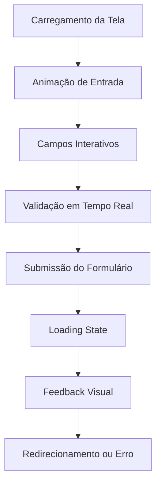

# Melhorias na UI do Login - BKCRM

## 1. Visão Geral do Produto

Melhorias na interface de usuário da tela de login do BKCRM para proporcionar uma experiência mais moderna, acessível e intuitiva.

* Foco em design contemporâneo com elementos visuais atraentes e funcionais

* Melhoria na usabilidade e acessibilidade para todos os tipos de usuários

* Otimização da experiência em diferentes dispositivos e tamanhos de tela

## 2. Funcionalidades Principais

### 2.1 Papéis de Usuário

Não aplicável - melhorias focam na interface, não em funcionalidades de autenticação.

### 2.2 Módulo de Funcionalidades

Nossas melhorias na UI do login consistem nas seguintes áreas principais:

1. **Design Visual**: gradientes modernos, glassmorphism, micro-animações
2. **Campos de Entrada**: validação em tempo real, indicadores visuais, feedback imediato
3. **Botões e Interações**: estados hover/focus aprimorados, loading states elegantes
4. **Layout Responsivo**: adaptação otimizada para mobile, tablet e desktop
5. **Acessibilidade**: contraste melhorado, navegação por teclado, leitores de tela

### 2.3 Detalhes das Páginas

| Nome da Página | Nome do Módulo    | Descrição da Funcionalidade                                                                                                                                                 |
| -------------- | ----------------- | --------------------------------------------------------------------------------------------------------------------------------------------------------------------------- |
| Tela de Login  | Design Visual     | Implementar gradiente de fundo moderno com cores do tema BKCRM, adicionar efeito glassmorphism no container principal, incluir logo animado com micro-animações sutis       |
| Tela de Login  | Campos de Entrada | Adicionar validação em tempo real com indicadores visuais (ícones de sucesso/erro), implementar placeholders animados, melhorar feedback visual para estados de foco e erro |
| Tela de Login  | Botões de Ação    | Criar estados hover/focus mais expressivos, adicionar loading states com spinners elegantes, implementar ripple effects nos botões                                          |
| Tela de Login  | Layout Responsivo | Otimizar espaçamento e proporções para diferentes breakpoints, ajustar tamanhos de fonte e elementos para melhor legibilidade                                               |
| Tela de Login  | Acessibilidade    | Melhorar contraste de cores conforme WCAG 2.1, adicionar labels semânticos, implementar navegação por teclado otimizada                                                     |
| Tela de Login  | Animações         | Adicionar transições suaves entre estados, implementar animações de entrada dos elementos, criar feedback visual para interações                                            |

## 3. Processo Principal

Fluxo de interação do usuário com a tela de login melhorada:

1. **Carregamento da Tela**: Animação de entrada suave dos elementos
2. **Interação com Campos**: Feedback visual imediato ao focar/digitar
3. **Validação**: Indicadores visuais em tempo real para validação
4. **Submissão**: Loading state elegante durante autenticação
5. **Feedback**: Mensagens de erro/sucesso com animações apropriadas

## 4. Design da Interface do Usuário

### 4.1 Estilo de Design

* **Cores Primárias**: Gradiente azul (#3B82F6 para #6366F1) como fundo principal

* **Cores Secundárias**: Branco (#FFFFFF) para containers, cinza (#F8FAFC) para campos

* **Estilo de Botão**: Botões arredondados com sombras sutis e efeitos hover

* **Fonte**: Inter ou SF Pro Display, tamanhos 14px-32px conforme hierarquia

* **Layout**: Design centrado com glassmorphism, espaçamento generoso

* **Ícones**: Phosphor Icons com estilo outline, tamanho 20-24px

* **Animações**: Transições suaves de 200-300ms, easing curves naturais

### 4.2 Visão Geral do Design da Página

| Nome da Página | Nome do Módulo       | Elementos da UI                                                                        |
| -------------- | -------------------- | -------------------------------------------------------------------------------------- |
| Tela de Login  | Container Principal  | Glassmorphism com backdrop-blur, border radius 16px, sombra sutil, padding responsivo  |
| Tela de Login  | Logo e Título        | Logo animado 80px, título "BKCRM" em 32px bold, subtítulo em 16px regular              |
| Tela de Login  | Campos de Entrada    | TextFields com border radius 12px, padding 16px, ícones à esquerda, validação colorida |
| Tela de Login  | Botão Principal      | Background gradient, height 56px, border radius 12px, texto bold 16px, loading spinner |
| Tela de Login  | Links Secundários    | Texto 14px medium, cor primária, hover underline, espaçamento 8px                      |
| Tela de Login  | Checkbox Remember Me | Custom checkbox com animação, label 14px, espaçamento 12px                             |
|           |                 |                                                                                   |

### 4.3 Responsividade

Design mobile-first com adaptações para desktop:

* **Mobile (< 768px)**: Layout vertical, padding 16px, campos full-width

* **Tablet (768px-1024px)**: Container centralizado 400px, padding 24px

* **Desktop (> 1024px)**: Container 450px, padding 32px, elementos maiores

* **Interação Touch**: Áreas de toque mínimas 44px, espaçamento adequado

* **Acessibilidade**: Suporte completo a leitores de tela e navegação por teclado

