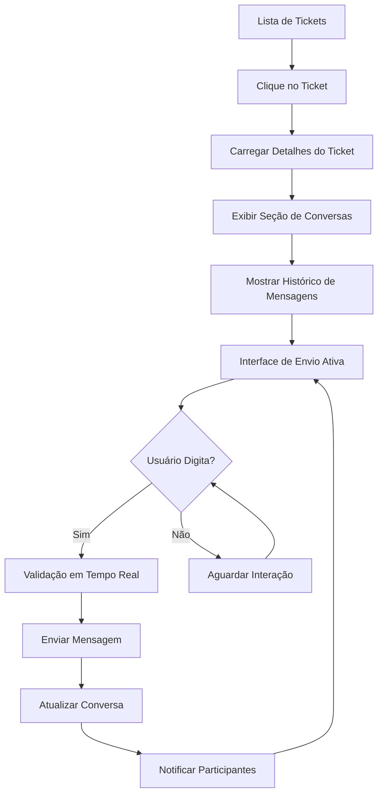

# Integração de Conversas nos Detalhes do Ticket - BKCRM

## 1. Visão Geral do Produto

Integração das conversas diretamente na página de detalhes do ticket para centralizar toda a comunicação relacionada ao ticket em um local único. O objetivo é melhorar a experiência do usuário eliminando a necessidade de navegar entre diferentes seções para acessar conversas relacionadas ao ticket.

## 2. Funcionalidades Principais

### 2.1 Papéis de Usuário

| Papel             | Método de Acesso     | Permissões Principais                                |
| ----------------- | -------------------- | ---------------------------------------------------- |
| Agente de Suporte | Login no sistema     | Pode visualizar e responder conversas do ticket      |
| Cliente           | Acesso via ticket    | Pode visualizar e enviar mensagens no ticket         |
| Administrador     | Login administrativo | Acesso completo a todas as conversas e configurações |

### 2.2 Módulo de Funcionalidades

Nossa integração de conversas nos detalhes do ticket consiste nas seguintes páginas principais:

1. **Página de Detalhes do Ticket**: seção de conversas integrada, histórico de mensagens, envio de novas mensagens.
2. **Interface de Chat Integrada**: área de mensagens em tempo real, indicadores de digitação, status de leitura.
3. **Painel de Participantes**: lista de usuários na conversa, status online, informações de contato.

### 2.3 Detalhes das Páginas

| Nome da Página     | Nome do Módulo          | Descrição da Funcionalidade                                                                        |
| ------------------ | ----------------------- | -------------------------------------------------------------------------------------------------- |
| Detalhes do Ticket | Seção de Conversas      | Exibir todas as mensagens relacionadas ao ticket em ordem cronológica com informações do remetente |
| Detalhes do Ticket | Envio de Mensagens      | Permitir envio de novas mensagens com validação em tempo real e feedback visual                    |
| Detalhes do Ticket | Histórico de Atividades | Mostrar timeline integrado com mensagens e atividades do ticket                                    |
| Detalhes do Ticket | Indicadores de Status   | Exibir status de leitura, indicadores de digitação e presença online dos participantes             |
| Detalhes do Ticket | Anexos e Mídia          | Suporte para envio e visualização de arquivos, imagens e documentos                                |
| Detalhes do Ticket | Sugestões de IA         | Integrar sugestões de resposta da IA diretamente na interface de chat                              |
| Detalhes do Ticket | Filtros de Mensagens    | Permitir filtrar mensagens por tipo, remetente ou período                                          |
| Detalhes do Ticket | Busca em Conversas      | Funcionalidade de busca dentro das mensagens do ticket                                             |

## 3. Processo Principal

### Fluxo Principal do Usuário:

1. Usuário clica em um ticket na lista de tickets
2. Sistema carrega a página de detalhes do ticket
3. Seção de conversas é exibida automaticamente com histórico de mensagens
4. Usuário pode visualizar todas as mensagens relacionadas ao ticket
5. Usuário pode enviar novas mensagens diretamente na interface
6. Sistema atualiza em tempo real com novas mensagens e atividades
7. Todas as interações ficam centralizadas no contexto do ticket

### Fluxo de Envio de Mensagem:

1. Usuário digita mensagem no campo de entrada
2. Sistema valida conteúdo em tempo real
3. Usuário clica em enviar ou pressiona Enter
4. Sistema processa e envia a mensagem
5. Mensagem aparece imediatamente na conversa
6. Sistema notifica outros participantes
7. Indicadores de status são atualizados

## 4. Design da Interface do Usuário

### 4.1 Estilo de Design

* **Cores Primárias**: #3B82F6 (azul primário), #1F2937 (texto escuro)

* **Cores Secundárias**: #F8FAFC (fundo claro), #E5E7EB (bordas)

* **Estilo de Botões**: Bordas arredondadas (12px), sombras suaves, estados hover bem definidos

* **Fontes**: Inter para títulos (16px-20px), System UI para mensagens (14px)

* **Layout**: Design em cards com espaçamento consistente (16px, 24px), seção de chat integrada

* **Ícones**: Phosphor Icons com tamanho 20px, cores consistentes com o tema

### 4.2 Visão Geral do Design das Páginas

| Nome da Página     | Nome do Módulo      | Elementos da UI                                                    |
| ------------------ | ------------------- | ------------------------------------------------------------------ |
| Detalhes do Ticket | Cabeçalho do Ticket | Título, status badge, informações básicas, botões de ação          |
| Detalhes do Ticket | Seção de Conversas  | Container com altura fixa, scroll automático, mensagens em bubbles |
| Detalhes do Ticket | Área de Mensagens   | Bubbles diferenciados por remetente, timestamps, status de leitura |
| Detalhes do Ticket | Campo de Entrada    | Input expansível, botão de envio, indicador de digitação           |
| Detalhes do Ticket | Painel Lateral      | Lista de participantes, status online, informações de contato      |
| Detalhes do Ticket | Sugestões de IA     | Cards com sugestões, botões de aplicação rápida                    |

### 4.3 Responsividade

Design adaptativo com foco em usabilidade:

* **Mobile**: Layout vertical, seção de chat em tela cheia quando ativa

* **Tablet**: Layout híbrido com seção de chat em painel lateral

* **Desktop**: Layout de duas colunas com detalhes do ticket e chat lado a lado

* **Touch**: Áreas de toque otimizadas, gestos para navegação

## 5. Especificações Técnicas

### 5.1 Integração com Sistema Existente

* Utilizar modelos existentes: `Ticket`, `Chat`, `Message`, `User`

* Integrar com `TicketStore` e `ChatStore` para gerenciamento de estado

* Manter compatibilidade com WebSocket para atualizações em tempo real

* Aproveitar serviços existentes: `GeminiService` para sugestões de IA

### 5.2 Estrutura de Dados

* Relacionamento `Ticket.chatId` para vincular ticket à conversa

* Campo `Chat.ticketId` para identificar chats de tickets

* Tipo `ChatType.ticket` para diferenciar chats de suporte

* Mensagens com contexto do ticket em `Message.metadata`

### 5.3 Performance

* Carregamento lazy das mensagens antigas

* Cache local para mensagens recentes

* Otimização de scroll com virtualização

* Debounce para indicadores de digitação

## 6. Benefícios da Integração

### 6.1 Experiência do Usuário

* **Contexto Unificado**: Todas as informações do ticket em um local

* **Navegação Simplificada**: Elimina necessidade de trocar entre telas

* **Eficiência**: Resposta mais rápida com contexto completo

* **Histórico Completo**: Visão cronológica de todas as interações

### 6.2 Produtividade

* **Tempo Reduzido**: Menos cliques para acessar conversas

* **Contexto Preservado**: Informações do ticket sempre visíveis

* **Colaboração**: Múltiplos agentes podem acompanhar em tempo real

* **Rastreabilidade**: Histórico completo de comunicações

### 6.3 Manutenibilidade

* **Código Reutilizado**: Aproveita componentes existentes de chat

* **Arquitetura Consistente**: Mantém padrões estabelecidos

* **Escalabilidade**: Estrutura preparada para futuras expansões

* **Testabilidade**: Componentes isolados e testáveis

