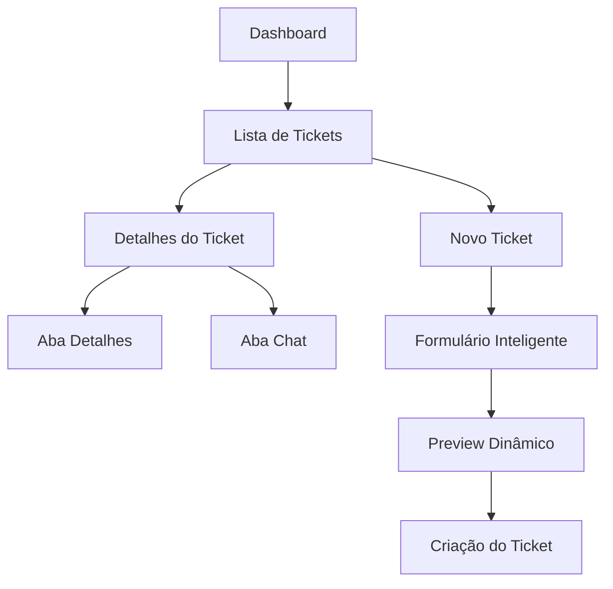

# Melhorias na UI dos Tickets - BKCRM

## 1. Visão Geral do Produto

O sistema BKCRM Flutter possui páginas de tickets que necessitam de melhorias visuais e de experiência do usuário para aumentar a produtividade e satisfação dos usuários. As melhorias focarão em modernização visual, componentes mais intuitivos e melhor organização da informação.

## 2. Funcionalidades Principais

### 2.1 Papéis de Usuário

| Papel | Método de Acesso | Permissões Principais |
|-------|------------------|----------------------|
| Admin | Login administrativo | Visualizar todos os tickets, gerenciar status, atribuir agentes |
| Agente | Login de agente | Visualizar tickets atribuídos, responder mensagens, atualizar status |
| Cliente | Login de cliente | Visualizar próprios tickets, enviar mensagens, acompanhar progresso |

### 2.2 Módulos de Funcionalidades

Nossas melhorias de UI dos tickets consistem nas seguintes páginas principais:
1. **Lista de Tickets**: grid/lista responsiva, filtros avançados, busca inteligente, estatísticas visuais
2. **Detalhes do Ticket**: layout em abas, chat integrado, timeline de ações, sugestões de IA
3. **Formulário de Ticket**: campos inteligentes, validação em tempo real, preview dinâmico
4. **Dashboard de Tickets**: métricas visuais, gráficos interativos, ações rápidas

### 2.3 Detalhes das Páginas

| Página | Módulo | Descrição da Funcionalidade |
|--------|--------|-----------------------------|
| Lista de Tickets | Grid Responsivo | Alternar entre visualização em cards e lista, com animações suaves |
| Lista de Tickets | Filtros Avançados | Sidebar com filtros por status, prioridade, categoria e agente |
| Lista de Tickets | Busca Inteligente | Campo de busca com sugestões automáticas e filtros contextuais |
| Lista de Tickets | Estatísticas Visuais | Cards com métricas de tickets por status com gráficos em miniatura |
| Detalhes do Ticket | Layout em Abas | Separação entre detalhes do ticket e chat em abas navegáveis |
| Detalhes do Ticket | Chat Integrado | Interface de chat em tempo real com indicadores de digitação |
| Detalhes do Ticket | Timeline de Ações | Histórico visual de todas as ações realizadas no ticket |
| Detalhes do Ticket | Sugestões de IA | Painel lateral com sugestões contextuais para respostas |
| Formulário de Ticket | Campos Inteligentes | Campos com validação em tempo real e ícones contextuais |
| Formulário de Ticket | Preview Dinâmico | Visualização em tempo real do ticket sendo criado |
| Formulário de Ticket | Categorização Automática | Sugestão automática de categoria baseada na descrição |
| Dashboard de Tickets | Métricas Visuais | Gráficos interativos com dados de performance |
| Dashboard de Tickets | Ações Rápidas | Botões de acesso rápido para funcionalidades principais |
| Dashboard de Tickets | Widgets Personalizáveis | Layout customizável com widgets arrastáveis |

## 3. Processo Principal

### Fluxo do Usuário Admin:
1. Acessa dashboard com visão geral dos tickets
2. Visualiza métricas e gráficos de performance
3. Navega para lista de tickets com filtros avançados
4. Seleciona ticket para visualizar detalhes
5. Utiliza abas para alternar entre detalhes e chat
6. Gerencia status e atribuições através de ações rápidas

### Fluxo do Usuário Agente:
1. Acessa lista de tickets atribuídos
2. Utiliza filtros para priorizar trabalho
3. Abre detalhes do ticket em layout otimizado
4. Responde mensagens usando sugestões de IA
5. Atualiza status através de interface intuitiva

### Fluxo do Usuário Cliente:
1. Cria novo ticket através de formulário inteligente
2. Acompanha progresso na lista de tickets pessoais
3. Interage através do chat integrado
4. Recebe notificações visuais de atualizações

## 4. Design da Interface do Usuário

### 4.1 Estilo de Design

- **Cores Primárias**: 
  - Azul Principal: #3B82F6 (botões, links, indicadores)
  - Verde Sucesso: #22C55E (status positivos, confirmações)
  - Vermelho Erro: #EF4444 (alertas, status críticos)
  - Amarelo Aviso: #F59E0B (avisos, pendências)

- **Cores Secundárias**:
  - Cinza Claro: #F8FAFC (fundo principal)
  - Cinza Médio: #6B7280 (textos secundários)
  - Cinza Escuro: #374151 (textos principais)
  - Branco: #FFFFFF (cards, modais)

- **Estilo dos Botões**: Bordas arredondadas (8px), sombras suaves, estados hover/focus
- **Tipografia**: 
  - Fonte Principal: Inter (14px-16px para corpo)
  - Títulos: Inter Bold (18px-24px)
  - Código/IDs: Mono (12px-14px)

- **Layout**: Design baseado em cards com sombras suaves, navegação superior com abas
- **Ícones**: Phosphor Icons com estilo outline, tamanho 16px-24px

### 4.2 Visão Geral do Design das Páginas

| Página | Módulo | Elementos de UI |
|--------|--------|----------------|
| Lista de Tickets | Header | Barra de busca centralizada, filtros em dropdown, toggle de visualização |
| Lista de Tickets | Grid de Cards | Cards com sombra sutil, status colorido, avatares circulares, badges de prioridade |
| Lista de Tickets | Sidebar (Desktop) | Filtros organizados em seções, estatísticas em mini-cards |
| Detalhes do Ticket | Header | Breadcrumb, ID do ticket, ações rápidas em botões flutuantes |
| Detalhes do Ticket | Abas | TabBar com ícones, indicadores de atividade, animações suaves |
| Detalhes do Ticket | Chat | Bolhas de mensagem, indicadores de status, campo de entrada otimizado |
| Formulário de Ticket | Campos | Inputs com ícones, validação visual, placeholders inteligentes |
| Formulário de Ticket | Preview | Card lateral com atualização em tempo real, chips de categoria |
| Dashboard | Métricas | Cards com gradientes sutis, gráficos em donut, números destacados |
| Dashboard | Ações Rápidas | Botões grandes com ícones, cores temáticas, estados de loading |

### 4.3 Responsividade

- **Desktop-first** com adaptação para mobile
- **Breakpoints**:
  - Desktop: >1200px (layout com sidebar)
  - Tablet: 768px-1200px (layout adaptado)
  - Mobile: <768px (layout empilhado)
- **Otimização touch**: Botões com área mínima de 44px, gestos de swipe
- **Navegação adaptativa**: Menu hambúrguer em mobile, sidebar fixa em desktop

## 5. Funcionalidades Técnicas

### 5.1 Animações e Transições
- Animações de entrada escalonadas para listas
- Transições suaves entre abas (300ms)
- Loading states com shimmer effects
- Micro-interações em botões e cards

### 5.2 Performance
- ListView.builder para listas longas
- Lazy loading de imagens e dados
- Cache inteligente de dados frequentes
- Otimização de rebuilds com keys apropriadas

### 5.3 Acessibilidade
- Suporte a leitores de tela
- Navegação por teclado
- Contraste adequado (WCAG AA)
- Textos alternativos para ícones

## 6. Benefícios das Melhorias

### 6.1 Experiência do Usuário
- Interface mais intuitiva e moderna
- Redução de cliques para ações comuns
- Feedback visual imediato
- Navegação mais fluida

### 6.2 Produtividade
- Filtros avançados para encontrar tickets rapidamente
- Ações em lote para operações múltiplas
- Sugestões de IA para respostas mais rápidas
- Dashboard com métricas relevantes

### 6.3 Manutenibilidade
- Componentes reutilizáveis
- Design system consistente
- Código organizado e documentado
- Padrões de desenvolvimento claros

### 6.4 Escalabilidade
- Arquitetura modular
- Suporte a novos tipos de ticket
- Integração facilitada com novos serviços
- Performance otimizada para grandes volumes

---

**Desenvolvido para modernizar e otimizar a experiência de gerenciamento de tickets no BKCRM** 🎯