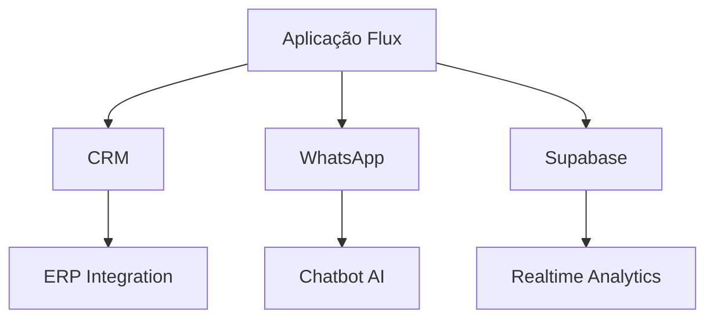

# Panorama do Projeto Flux

## Visão Geral
**Tecnologia Principal**: Aplicativo multiplataforma desenvolvido em Flutter
**Integrações Chave**:
- Supabase (banco de dados em tempo real)
- WhatsApp Business API
- Sistema de CRM

## Estrutura Atual
```
flux/
├── lib/           → Lógica principal do aplicativo
│   ├── src/       
│   │   ├── pages/ → Interfaces complexas (ex: perfil, detalhes de cotação)
│   │   ├── models/ → Definições de dados (User, Quote)
│   │   └── services/ → Conexões com APIs externas
├── assets/        → Recursos multimídia
├── guides/        → Documentação técnica
└── web/           → Build web
```

## Funcionalidades Existentes
- Sistema de autenticação modular
- Dashboard de métricas em tempo real
- Gerenciamento de perfis multi-nível (Admin/Agente/Cliente)
- Integração com WhatsApp para notificações
- Sistema de cotação com histórico

## Potencial de Evolução
1. **Expansão de Integrações**
   - Conexão com ERPs (ex: SAP, Totvs)
   - Pagamentos via PIX integrado
   - Assinatura digital de documentos

2. **Inteligência Artificial**
   - Chatbot para atendimento automático
   - Análise preditiva de cotações
   - Reconhecimento de documentos via OCR

3. **Otimizações Técnicas**
   - Migração para Flutter 3.0
   - Implementação de testes E2E
   - Padronização de Design System

4. **Expansão Multiplataforma**
   - Versão desktop (Windows/macOS/Linux)
   - Aplicativo para smartwatches
   - Versão PWA offline

